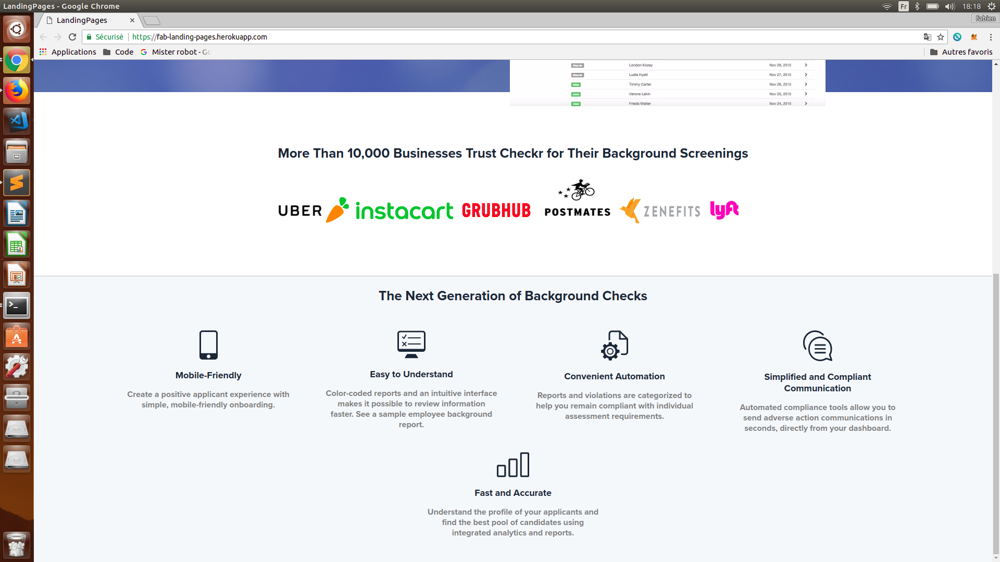

[Lien de mon app pour check](https://fab-landing-pages.herokuapp.com/)
  

J'ai mis des captures d'écrans car les guidelines d'aujourd'hui ne prennent pas en compte la responsivité, et nous n'avons pas tous les mêmes tailes d'écran, donc le même rendu !

[Lien de mon app pour flynn](https://fab-landing-pages.herokuapp.com/flynn)

Je n'ai pas fait d'index du coup pour accéder à Flynn depuis la même app il faut ajouter le /flynn depuis la root. Sinon cliquer sur le lien ci-dessus. <em>J'ai aussi découvert que certaines fonctionnalités de flex box ne fonctionnent pas sur Chrome et Safari, du coup Flynn est à ouvrir avec firefox... ça sera tellement plus simple avec Bootstrap !!</em>

